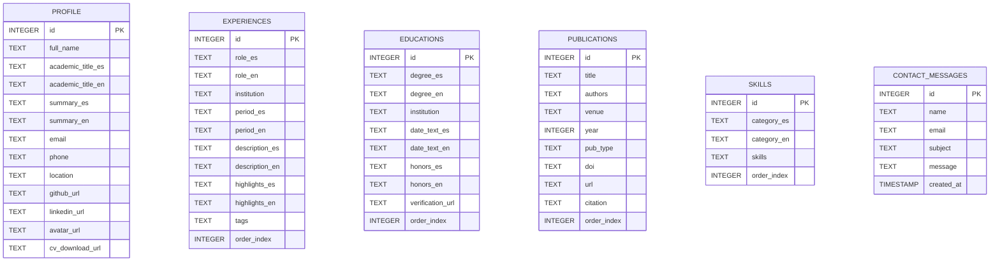

# Diccionario de Datos del Sistema

**Proyecto:** Website Personal y Académico — Dr. José Daniel Narváez Flores  
**Versión:** 1.0.0 (Versión Inicial de Análisis y Diseño)  
**Motor de Persistencia:** SQLite 3  
**Fecha:** Octubre 2026  
**Estado:** En revisión inicial  

---

## 1. Convenciones y Estándares

### 1.1 Nomenclatura
- **Nombres de tablas:** Escritos en minúsculas en plural o singular acorde al concepto de entidad (`profile`, `experiences`, `educations`, `publications`, `skills`, `contact_messages`).
- **Nombres de columnas (DB):** Formato `snake_case` (ejemplo: `academic_title_es`, `verification_url`).
- **Nombres de propiedades en API / DTOs:** Formato `camelCase` para compatibilidad idiomática con JavaScript/React (ejemplo: `academicTitle`, `verificationUrl`).
- **Sufijos de localización:** Los atributos que dependen del idioma emplean el sufijo `_es` para español y `_en` para inglés en la base de datos y en los modelos de dominio.

### 1.2 Correspondencia de Tipos de Datos
| Tipo Lógico | Tipo Físico (SQLite) | Tipo en Python | Tipo en TypeScript / JS |
| :--- | :--- | :--- | :--- |
| Entero Autoincremental | `INTEGER PRIMARY KEY AUTOINCREMENT` | `int` | `number` |
| Entero | `INTEGER` | `int` | `number` |
| Texto Corto / Cadena | `TEXT` | `str` | `string` |
| Texto Largo / Párrafo | `TEXT` | `str` | `string` |
| Arreglo Serializado (JSON) | `TEXT` | `List[str]` | `string[]` |
| Marca de Tiempo | `TIMESTAMP` | `str` / `datetime` | `string` (ISO 8601) |

---

## 2. Diagrama Entidad-Relación Lógico



---

## 3. Especificación Detallada de Tablas

### 3.1 Tabla: `profile`
- **Descripción:** Almacena la información biográfica fundamental, datos de contacto profesional, enlaces de redes científicas y enlaces a recursos descargables del Dr. José Daniel Narváez Flores.
- **Clave Primaria:** `id`

| Columna | Tipo SQLite | Nulo | Por Defecto | Descripción y Reglas de Negocio | Valor de Ejemplo |
| :--- | :--- | :--- | :--- | :--- | :--- |
| `id` | `INTEGER` | NO | AUTOINCREMENT | Identificador numérico único del registro de perfil. | `1` |
| `full_name` | `TEXT` | NO | Ninguno | Nombre completo con tratamiento académico. | `"Dr. José Daniel Narváez Flores"` |
| `academic_title_es` | `TEXT` | NO | Ninguno | Título y líneas de especialidad en español. | `"Doctor en Informática \| Investigador en CS e IA \| Ingeniero de Sistemas"` |
| `academic_title_en` | `TEXT` | NO | Ninguno | Título y líneas de especialidad en inglés. | `"Ph.D. in Computer Science \| CS & AI Researcher \| Systems Engineer"` |
| `summary_es` | `TEXT` | NO | Ninguno | Resumen biográfico y líneas de investigación en español. | `"Doctor en Informática por la Universidad Abierta Interamericana (UAI)..."` |
| `summary_en` | `TEXT` | NO | Ninguno | Resumen biográfico y líneas de investigación en inglés. | `"Ph.D. in Computer Science from Universidad Abierta Interamericana (UAI)..."` |
| `email` | `TEXT` | NO | Ninguno | Correo electrónico principal de contacto profesional. | `"jdnarvaezf@gmail.com"` |
| `phone` | `TEXT` | NO | Ninguno | Número telefónico en formato internacional con código de país. | `"+505 5774 1987"` |
| `location` | `TEXT` | NO | Ninguno | Ciudad y país de residencia habitual. | `"Rivas, Nicaragua"` |
| `github_url` | `TEXT` | NO | Ninguno | Enlace al perfil de GitHub con repositorios de código. | `"https://github.com/jdanieln"` |
| `linkedin_url` | `TEXT` | NO | Ninguno | Enlace al perfil oficial en LinkedIn. | `"https://linkedin.com/in/jdanielnf"` |
| `avatar_url` | `TEXT` | SÍ | `NULL` | URL de la imagen de perfil oficial alojada. | `"https://avatars.githubusercontent.com/u/53232152?v=4"` |
| `cv_download_url` | `TEXT` | SÍ | `NULL` | Ruta o URL directa para la descarga del Curriculum Vitae en PDF. | `"/cv/CV_Daniel_Narvaez.pdf"` |

---

### 3.2 Tabla: `experiences`
- **Descripción:** Registra la trayectoria laboral, académica, docente y de consultoría en orden cronológico inverso.
- **Clave Primaria:** `id`

| Columna | Tipo SQLite | Nulo | Por Defecto | Descripción y Reglas de Negocio | Valor de Ejemplo |
| :--- | :--- | :--- | :--- | :--- | :--- |
| `id` | `INTEGER` | NO | AUTOINCREMENT | Identificador numérico único de la experiencia. | `1` |
| `role_es` | `TEXT` | NO | Ninguno | Denominación del cargo o rol profesional en español. | `"Profesor Adjunto e Investigador en CS e IA"` |
| `role_en` | `TEXT` | NO | Ninguno | Denominación del cargo o rol profesional en inglés. | `"Adjunct Professor & Researcher in CS and AI"` |
| `institution` | `TEXT` | NO | Ninguno | Nombre de la entidad, universidad u organización. | `"Keiser University"` |
| `period_es` | `TEXT` | NO | Ninguno | Rango temporal descriptivo en español. | `"Ene 2026 - Presente"` |
| `period_en` | `TEXT` | NO | Ninguno | Rango temporal descriptivo en inglés. | `"Jan 2026 - Present"` |
| `description_es` | `TEXT` | NO | Ninguno | Descripción sintética de las responsabilidades en español. | `"Docencia e investigación de frontera en Ciencias de la Computación..."` |
| `description_en` | `TEXT` | NO | Ninguno | Descripción sintética de las responsabilidades en inglés. | `"Teaching and cutting-edge research in Computer Science..."` |
| `highlights_es` | `TEXT` | SÍ | `NULL` | Arreglo JSON de viñetas con logros principales en español. | `'["Impartición de lecciones avanzadas...", "Investigación en AI4SE..."]'` |
| `highlights_en` | `TEXT` | SÍ | `NULL` | Arreglo JSON de viñetas con logros principales en inglés. | `'["Delivery of advanced lectures...", "Active research in AI4SE..."]'` |
| `tags` | `TEXT` | SÍ | `NULL` | Arreglo JSON con etiquetas de tecnologías o áreas temáticas. | `'["AI4SE", "Machine Learning", "Research"]'` |
| `order_index` | `INTEGER` | SÍ | `0` | Criterio de ordenamiento para presentación (menor valor aparece primero). | `1` |

---

### 3.3 Tabla: `educations`
- **Descripción:** Almacena los grados académicos oficiales (Doctorado, Maestrías, Licenciaturas/Ingenierías) junto a sus credenciales electrónicas verificables.
- **Clave Primaria:** `id`

| Columna | Tipo SQLite | Nulo | Por Defecto | Descripción y Reglas de Negocio | Valor de Ejemplo |
| :--- | :--- | :--- | :--- | :--- | :--- |
| `id` | `INTEGER` | NO | AUTOINCREMENT | Identificador numérico único de la titulación. | `1` |
| `degree_es` | `TEXT` | NO | Ninguno | Nombre oficial del título/grado en español. | `"Doctorado en Informática"` |
| `degree_en` | `TEXT` | NO | Ninguno | Nombre oficial del título/grado en inglés. | `"Ph.D. in Computer Science"` |
| `institution` | `TEXT` | NO | Ninguno | Institución universitaria otorgante del título. | `"Universidad Abierta Interamericana (UAI)"` |
| `date_text_es` | `TEXT` | NO | Ninguno | Fecha de expedición o graduación en español. | `"Feb 2026"` |
| `date_text_en` | `TEXT` | NO | Ninguno | Fecha de expedición o graduación en inglés. | `"Feb 2026"` |
| `honors_es` | `TEXT` | SÍ | `NULL` | Menciones de honor, título de tesis o reconocimientos en español. | `"Tesis: 'Descubrimiento y diseño de microservicios...'"` |
| `honors_en` | `TEXT` | SÍ | `NULL` | Menciones de honor, título de tesis o reconocimientos en inglés. | `"Thesis: 'AI-assisted Discovery and Design of Microservices...'"` |
| `verification_url` | `TEXT` | SÍ | `NULL` | URL oficial para validación electrónica (repositorio o validador CSV institucional). | `"https://repositorio.uai.edu.ar/..."` |
| `order_index` | `INTEGER` | SÍ | `0` | Criterio de ordenación para visualización cronológica. | `1` |

---

### 3.4 Tabla: `publications`
- **Descripción:** Catálogo de artículos en revistas indexadas, actas de congresos internacionales, tesis doctorales y workshops técnicos.
- **Clave Primaria:** `id`

| Columna | Tipo SQLite | Nulo | Por Defecto | Descripción y Reglas de Negocio | Valor de Ejemplo |
| :--- | :--- | :--- | :--- | :--- | :--- |
| `id` | `INTEGER` | NO | AUTOINCREMENT | Identificador numérico único de la publicación. | `1` |
| `title` | `TEXT` | NO | Ninguno | Título completo del artículo o publicación científica. | `"MAPE-KV: A Knowledge-Validation Loop for Architecture Discovery"` |
| `authors` | `TEXT` | NO | Ninguno | Lista de autores separados por comas. | `"Narváez, J. D., & Colaboradores"` |
| `venue` | `TEXT` | NO | Ninguno | Nombre de la revista, simposio, conferencia o editorial. | `"IEEE Transactions on Software Engineering"` |
| `year` | `INTEGER` | NO | Ninguno | Año de publicación oficial. | `2025` |
| `pub_type` | `TEXT` | NO | Ninguno | Categoría de publicación (`journal`, `conference`, `thesis`, `workshop`). | `"journal"` |
| `doi` | `TEXT` | SÍ | `NULL` | Digital Object Identifier del documento científico. | `"10.1109/TSE.2025.0001"` |
| `url` | `TEXT` | SÍ | `NULL` | Enlace directo al PDF, repositorio o página oficial del artículo. | `"https://doi.org/10.1109/TSE.2025.0001"` |
| `citation` | `TEXT` | SÍ | `NULL` | Cita bibliográfica estandarizada para copiado rápido por el usuario. | `"Narváez, J. D. (2025). MAPE-KV... IEEE TSE."` |
| `order_index` | `INTEGER` | SÍ | `0` | Índice de posición para visualización destacada. | `1` |

---

### 3.5 Tabla: `skills`
- **Descripción:** Agrupaciones temáticas de competencias técnicas, investigativas, lenguajes y herramientas.
- **Clave Primaria:** `id`

| Columna | Tipo SQLite | Nulo | Por Defecto | Descripción y Reglas de Negocio | Valor de Ejemplo |
| :--- | :--- | :--- | :--- | :--- | :--- |
| `id` | `INTEGER` | NO | AUTOINCREMENT | Identificador numérico único de la categoría. | `1` |
| `category_es` | `TEXT` | NO | Ninguno | Nombre de la categoría de habilidades en español. | `"Investigación & Métodos Formales"` |
| `category_en` | `TEXT` | NO | Ninguno | Nombre de la categoría de habilidades en inglés. | `"Research & Formal Methods"` |
| `skills` | `TEXT` | NO | Ninguno | Arreglo JSON de strings con las competencias individuales de la categoría. | `'["AI4SE", "Lean 4", "Neuro-Symbolic Systems", "Formal Verification"]'` |
| `order_index` | `INTEGER` | SÍ | `0` | Orden de visualización del bloque temático. | `1` |

---

### 3.6 Tabla: `contact_messages`
- **Descripción:** Registro histórico de los mensajes enviados por los usuarios a través del formulario de contacto.
- **Clave Primaria:** `id`

| Columna | Tipo SQLite | Nulo | Por Defecto | Descripción y Reglas de Negocio | Valor de Ejemplo |
| :--- | :--- | :--- | :--- | :--- | :--- |
| `id` | `INTEGER` | NO | AUTOINCREMENT | Identificador numérico secuencial del mensaje recibido. | `1` |
| `name` | `TEXT` | NO | Ninguno | Nombre del remitente. Mínimo 2 caracteres. | `"Dr. Carlos Mendoza"` |
| `email` | `TEXT` | NO | Ninguno | Correo electrónico de contacto del remitente con formato válido. | `"carlos.mendoza@universidad.edu"` |
| `subject` | `TEXT` | NO | Ninguno | Motivo o asunto del contacto. Mínimo 3 caracteres. | `"Colaboración en Taller de Verificación Formal"` |
| `message` | `TEXT` | NO | Ninguno | Cuerpo textual del mensaje. Mínimo 10 caracteres. | `"Estimado Dr. Narváez, nos gustaría invitarlo a dictar una ponencia..."` |
| `created_at` | `TIMESTAMP` | SÍ | `CURRENT_TIMESTAMP` | Marca temporal UTC generada automáticamente por SQLite al insertar. | `"2026-10-02 15:30:00"` |

---

## 4. Estructuras de Datos Serializadas en JSON

Para optimizar el diseño relacional sin introducir sobrecosto de uniones (*joins*) en colecciones atómicas que siempre se consumen en bloque, se utilizan campos `TEXT` serializados en JSON:

### 4.1 Formato de `highlights_es` y `highlights_en` (`experiences`)
```json
[
  "Impartición de lecciones avanzadas y mentoría de estudiantes en desafíos técnicos complejos.",
  "Investigación activa en AI4SE orientada a la difusión en la comunidad científica internacional."
]
```

### 4.2 Formato de `tags` (`experiences`)
```json
[
  "AI4SE",
  "Machine Learning",
  "Research",
  "Higher Education"
]
```

### 4.3 Formato de `skills` (`skills`)
```json
[
  "AI4SE",
  "Verificación Formal con Lean 4",
  "Sistemas Neuro-Simbólicos (ArchiGenMS, MAPE-KV)",
  "Matemática Computacional y Optimización",
  "Computación Cuántica"
]
```

---

## 5. Contratos de la API REST (DTOs)

### 5.1 Respuesta Localizada de Perfil (`GET /api/profile?lang=es|en`)
```json
{
  "id": 1,
  "fullName": "Dr. José Daniel Narváez Flores",
  "academicTitle": "Doctor en Informática | Investigador en CS e IA | Ingeniero de Sistemas",
  "summary": "Doctor en Informática por la Universidad Abierta Interamericana (UAI)...",
  "email": "jdnarvaezf@gmail.com",
  "phone": "+505 5774 1987",
  "location": "Rivas, Nicaragua",
  "githubUrl": "https://github.com/jdanieln",
  "linkedinUrl": "https://linkedin.com/in/jdanielnf",
  "avatarUrl": "https://avatars.githubusercontent.com/u/53232152?v=4",
  "cvDownloadUrl": "/cv/CV_Daniel_Narvaez.pdf"
}
```

### 5.2 Solicitud de Envío de Mensaje (`POST /api/contact`)
#### Request Payload:
```json
{
  "name": "Dr. Carlos Mendoza",
  "email": "carlos.mendoza@universidad.edu",
  "subject": "Invitación a Ponencia Internacional",
  "message": "Estimado Dr. Narváez, le extendemos una cordial invitación para participar en..."
}
```

#### Response Payload (201 Created):
```json
{
  "success": true,
  "message": "Message sent successfully",
  "id": 1
}
```

#### Response Payload (400 Bad Request):
```json
{
  "error": "Todos los campos (nombre, email, asunto y mensaje) son requeridos y deben ser válidos."
}
```
